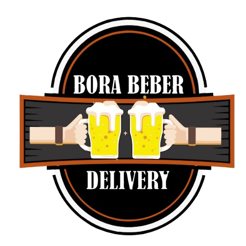

<div align="center">
  
  <h1 align="center">Bora Beber - Delivery de Bebidas</h1>
  <p align="center">
    Um sistema completo de delivery de bebidas construído com as tecnologias mais modernas, incluindo um painel de administração robusto para gerenciamento total da loja.
  </p>
</div>

<br/>

##  Funcionalidades Principais

O projeto é dividido em duas partes principais: a vitrine para o cliente e um painel de controle completo para o administrador.

###  Para o Cliente
- **Vitrine de Produtos:** Catálogo de produtos organizado por categorias.
- **Status da Loja:** Visualização em tempo real se a loja está aberta ou fechada.
- **Carrinho de Compras:** Adição e gerenciamento de itens de forma persistente.
- **Checkout Simplificado (Convidado):** Processo de finalização de pedido sem a necessidade de criar uma conta.
- **Cálculo de Frete:** Custo de entrega calculado com base no bairro (lógica de exemplo).
- **Acompanhamento de Pedidos:** Tela para visualizar o status de todos os pedidos realizados.
- **Design Responsivo:** Experiência de usuário otimizada para desktops e dispositivos móveis.

###  Para o Administrador
- **Dashboard com Métricas:** Visão geral da receita, total de pedidos, clientes e produtos.
- **Controle da Loja:** Abertura e fechamento manual da loja, sobrepondo o horário programado.
- **Gerenciamento de Pedidos:**
    - Visualização de pedidos ativos, finalizados e cancelados.
    - Atualização de status do pedido (preparo, trânsito, entregue).
    - Notificação via WhatsApp para o cliente ao aceitar o pedido.
    - Impressão de comandas.
- **Gerenciamento de Produtos:** CRUD completo (Criar, Ler, Atualizar, Excluir) para os produtos do catálogo.
- **Gerenciamento de Categorias:** Adicione, edite e remova categorias de produtos.
- **Gerenciamento de Ofertas:** Ative ou desative produtos na página de ofertas.
- **Análises Gráficas:** Gráficos de vendas mensais, vendas por categoria e produtos mais vendidos.
- **Autenticação Segura:** Acesso ao painel protegido por autenticação do Firebase.

---

##  Tecnologias Utilizadas

- **Framework:** [Next.js](https://nextjs.org/) (App Router)
- **Backend e Banco de Dados:** [Firebase](https://firebase.google.com/) (Firestore, Authentication, Storage)
- **Estilização:** [Tailwind CSS](https://tailwindcss.com/)
- **Componentes de UI:** [Shadcn/UI](https://ui.shadcn.com/)
- **Gerenciamento de Estado:** [Zustand](https://zustand-demo.pmnd.rs/)
- **Validação de Formulários:** [React Hook Form](https://react-hook-form.com/) & [Zod](https://zod.dev/)
- **Gráficos:** [Recharts](https://recharts.org/)
- **Deployment:** O projeto está pronto para deploy no [Firebase App Hosting](https://firebase.google.com/docs/hosting).

---

##  Como Executar o Projeto Localmente

Siga os passos abaixo para configurar e rodar o projeto em seu ambiente de desenvolvimento.

### 1. Pré-requisitos
- [Node.js](https://nodejs.org/en/) (versão 18 ou superior)
- [Git](https://git-scm.com/)
- Uma conta no [Firebase](https://firebase.google.com/)

### 2. Clone o Repositório
```bash
git clone https://github.com/jovi0503/bora-beber.git
cd bora-beber
```

### 3. Instale as Dependências
```bash
npm install
```

### 4. Configure as Variáveis de Ambiente
Este aplicativo depende de uma configuração com o Firebase para funcionar. Você precisará criar um arquivo `.env` na raiz do projeto e preenchê-lo com as credenciais do seu projeto Firebase.

   ```env
   NEXT_PUBLIC_FIREBASE_API_KEY=...
   NEXT_PUBLIC_FIREBASE_AUTH_DOMAIN=...
   NEXT_PUBLIC_FIREBASE_PROJECT_ID=...
   NEXT_PUBLIC_FIREBASE_STORAGE_BUCKET=...
   NEXT_PUBLIC_FIREBASE_MESSAGING_SENDER_ID=...
   NEXT_PUBLIC_FIREBASE_APP_ID=...
   ```
   **IMPORTANTE:** Após salvar o arquivo `.env`, reinicie seu servidor de desenvolvimento.

### 5. Execute o Servidor de Desenvolvimento

Agora que tudo está configurado, inicie a aplicação:
```bash
npm run dev
```

Abra [http://localhost:3000](http://localhost:3000) em seu navegador para ver a loja, ou acesse [http://localhost:3000/admin](http://localhost:3000/admin) para fazer login no painel de controle.

---

##  Autor

Desenvolvido por **João Vitor Santana**.

- **LinkedIn:** [linkedin.com/in/jovii](https://www.linkedin.com/in/jovii/)
- **GitHub:** [github.com/jovi0503](https://github.com/jovi0503)
